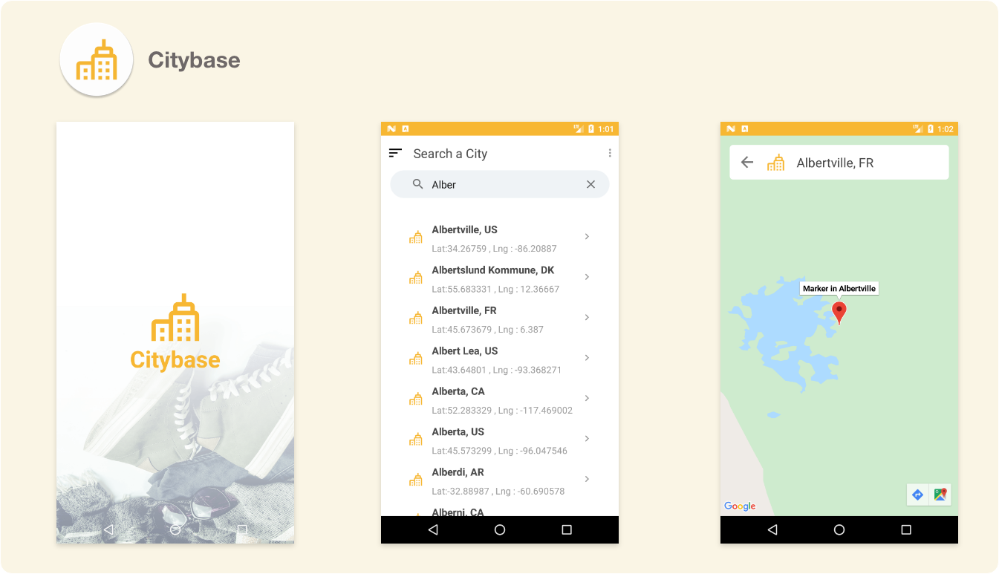

<p align="center">
    
</p>


# CityBase

>I have been asked to build a mobile application that implement a fast runtime search algorithm to filter  
> a large json file containing json object where each object represent a city.  
> I decided to build a MVVM kotlin application named `CityBase`.
 
 ## Results
- [x] Splashscreen
- [x] Scrollable List displaying all cities in the Json file
- [x] Search feature with case sensitive
- [x] City Detail displayed on a google Map
- [x] I have implemented a Binary search Algorithm to match requirements about time efficiency
- [x] Documentation
- [x] Responsive and support Device rotation
- [x] Implemented Unit test that match requiremets and ensure that app behave as expected


##  Preview



### Used

 - [Gson](https://github.com/google/gson)
 - [Kotlin](https://kotlinlang.org/)
 - [Kotlin DSL Plugin ( to manage dependencies )](https://docs.gradle.org/current/userguide/kotlin_dsl.html)
 - [Android Jetpack Librairies(LiveData, ViewModel,DataBinding, Layout, Fragment)](https://developer.android.com/jetpack)
 - [Coroutines (For asynchronous background processing)](https://kotlinlang.org/docs/reference/coroutines-overview.html)
 
 ## Get Started
 
 #### 1. Clone the Repo
 
 On the command prompt run the following commands
 ```sh
 $ git clone https://github.com/Doha26/Citybase.git
 
 $ import project Citybase in Android Studio IDE
 
 $ Accept SDK configuration to support your local SDK Location 
 
$ Sync and build the project

 ```
 
 ### Author

*	[Pavel Foujeu](mailto:foujeupavel@gmail.com)  
   [](https://www.linkedin.com/in/pavel-foujeu-8a8992142/)
   [](https://github.com/Doha26)


 
 ### Done with React-native
 *	[Instagram Clone ](https://github.com/Doha26/Instagram-clone)
 *	[Facebook challenge ](https://github.com/Doha26/Facebook-React-native)

